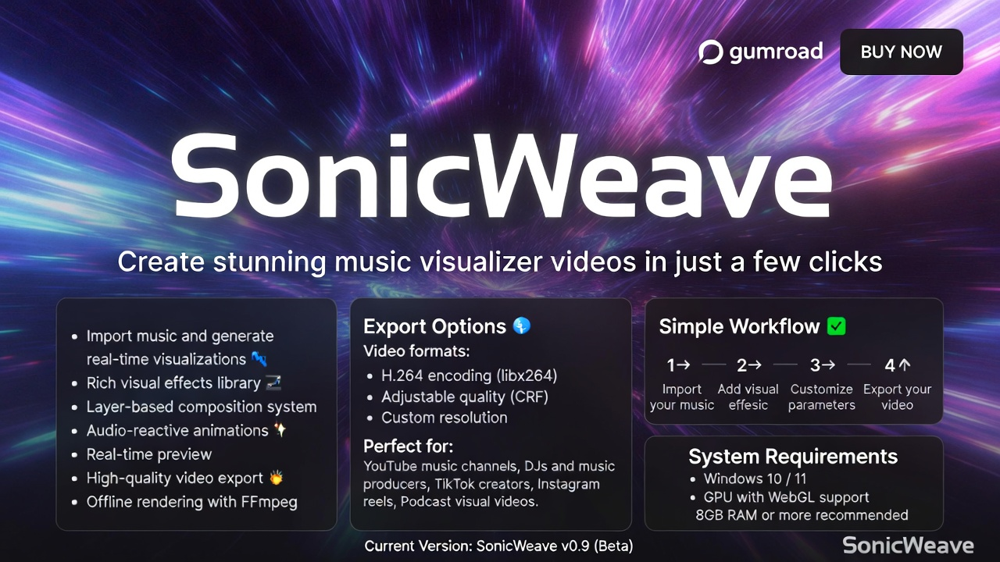
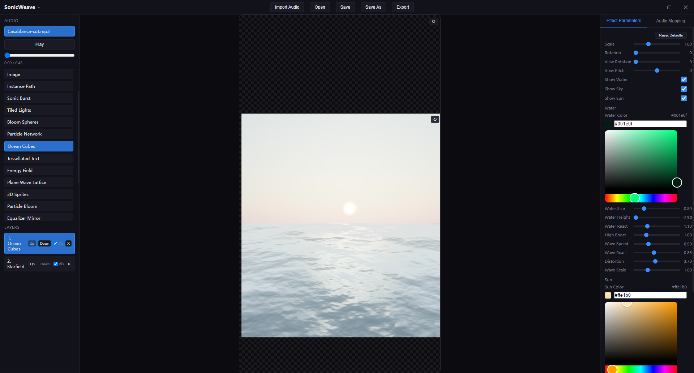
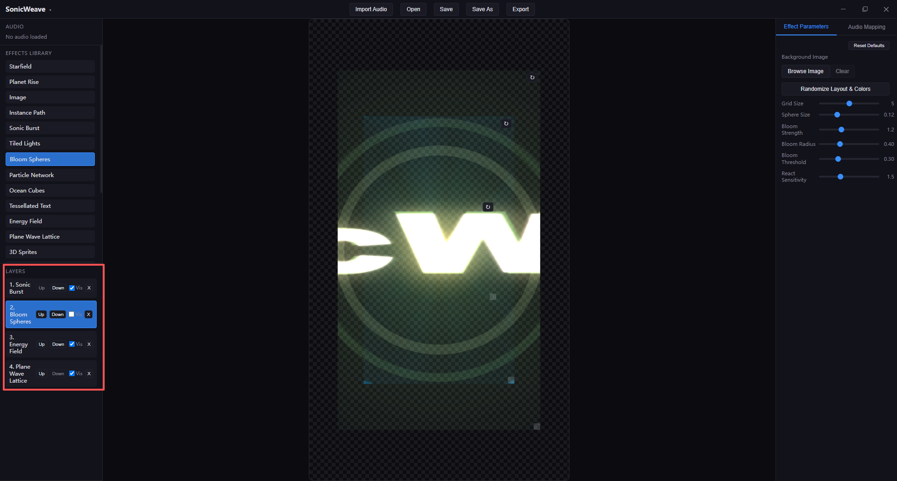
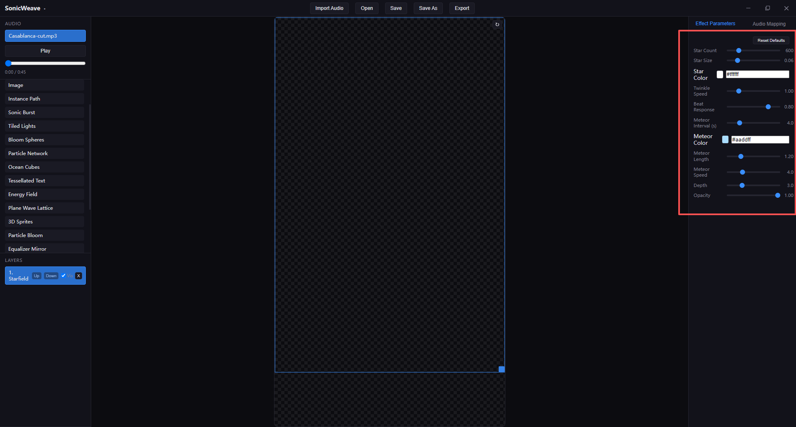
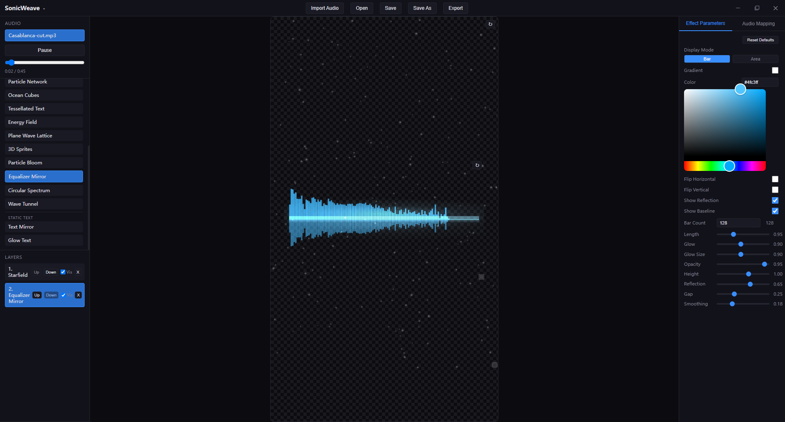

# SonicWeave

SonicWeave is a desktop audio visualizer and music visual effects editor built for creators who want fast, stylish, music-reactive visuals without building an entire motion graphics workflow from scratch.

It combines real-time audio analysis, layered visual composition, and a growing library of audio visualization effects, music visualization effects, and audio-reactive visual effects in one desktop app.

[Get SonicWeave on Gumroad](https://kunta35.gumroad.com/l/kibpl) • [Follow on Twitter/X](https://twitter.com/SonicWeaveApp) • [Watch on YouTube](https://www.youtube.com/@quentin-e9k)

---

## Hero Shot

---

## What SonicWeave Is

SonicWeave is designed for music producers, audio visual artists, content creators, VJs, and editors who want high-impact visuals driven by sound.

It works as:

- an audio visualizer
- a music visualizer
- an audio-reactive effects editor
- a music-reactive effects editor
- a desktop tool for layered audio and music visualization scenes

Whether you are making shorts, reels, lyric videos, looping promo visuals, live backdrops, or artist branding content, SonicWeave is built to help you move quickly from track to finished visuals.

---

## Why SonicWeave Stands Out

- Real-time audio visualization: turn sound into responsive motion instantly
- Layer-based workflow: stack multiple effects instead of being locked to one full-screen preset
- Music-reactive controls: tune behavior using low, mid, high, beat, onset, and overall energy
- Flexible canvas output: create vertical, landscape, or custom-sized compositions
- Built for iteration: save projects, reopen them, refine layers, and keep exploring

---

## Screenshots

### 1. Main Editor Workflow

> build a complete music-reactive scene inside one editor.

### 2. Effect Layering and Layout Control

> Combine multiple audio-reactive and music-reactive effects, reorder layers, and position each visual element freely on the canvas.

### 3. Effect Parameters and Audio Mapping

> Fine-tune effect behavior with dedicated parameter controls and audio mapping for low, mid, high, and energy response.

### 4. Cinematic Music Visualization Example

> build cinematic music visualization scenes with atmosphere, lighting, bloom, and motion.

Recommended screenshot types:

- one full editor screenshot
- one vertical composition screenshot
- one close-up of parameter controls
- one dramatic effect showcase with strong lighting or bloom

---

## Video Demos

Add your three YouTube links here. If you want, you can later rename the labels to match each video.

### Demo 1

[Watch Demo 1 on YouTube](https://youtu.be/LjFfWSmjYf4)

> A quick overview of the SonicWeave workflow, from importing audio to building a layered music visualization scene.

### Demo 2

[Watch Demo 2 on YouTube](https://youtube.com/shorts/jWxEp3SKRxU?feature=share)

> A showcase of audio-reactive effects, music-driven motion, and parameter tuning across different visual styles.

### Demo 3

[Watch Demo 3 on YouTube](https://youtube.com/shorts/MpQpa12dFZc?feature=share)

Suggested description:

> A polished example of a finished visual composition for social media, promo content, or music branding.

Tip:

- use one workflow video
- use one effect showcase video
- use one finished export or montage video

---

## Core Features

### Real-Time Audio and Music Visualization

SonicWeave transforms sound into motion in real time, making it suitable for both classic audio visualization and more cinematic music visualization.

- responsive audio analysis
- beat-aware motion
- onset-driven accents
- energy-based animation
- frequency-reactive visual changes

### Layer-Based Visual Composition

Each effect is a layer, so you can build richer scenes instead of relying on a single preset.

- add multiple visual layers
- move layers up and down
- toggle visibility
- resize and reposition layers
- combine effects into one composition

### Audio Mapping Controls

Control how visuals react to sound.

- map response to low, mid, high, or energy
- adjust sensitivity
- adjust smoothing
- clamp the response with min and max values

### Flexible Canvas Setup

Build visuals for the formats creators actually need.

- portrait for Shorts, Reels, and TikTok
- landscape for YouTube and live visuals
- custom canvas dimensions for flexible exports

### Background Media Support

Mix reactive effects with imported media.

- import background images
- import background videos
- choose video fit with `cover` or `contain`

### Project Workflow

SonicWeave is built as an editor, not just a demo player.

- save projects
- reopen projects
- preserve effect layers
- preserve media assignments
- preserve canvas settings

---

## Included Effects

SonicWeave includes a wide range of audio and music visualization effects:

- Particle Bloom
- Circular Spectrum
- Wave Tunnel
- Equalizer Mirror
- Energy Field
- Plane Wave Lattice
- Stormtrooper Dance
- Tessellated Text
- 3D Sprites
- Ocean
- Particle Network
- Bloom Spheres
- Tiled Lights
- Instance Path
- Image
- Sonic Burst
- Text Mirror
- Glow Text
- Starfield
- Planet Rise
- Horizon Glow

---

## Effect Categories

### Audio Visualization Effects

Ideal for classic sound-reactive visuals:

- Circular Spectrum
- Equalizer Mirror
- Particle Network
- Wave Tunnel
- Particle Bloom
- Tiled Lights

### Music Visualization Effects

Better suited for cinematic or promo-style visual storytelling:

- Sonic Burst
- Planet Rise
- Horizon Glow
- Ocean
- Starfield
- Bloom Spheres

### Typography and Branding Effects

Useful for artist names, song titles, logos, and promotional text:

- Tessellated Text
- Glow Text
- Text Mirror

### Experimental and Stylized Effects

Great for more distinctive visual identities:

- Energy Field
- Plane Wave Lattice
- 3D Sprites
- Instance Path
- Stormtrooper Dance

---

## Typical Use Cases

- music promo videos
- audio-reactive social content
- lyric videos
- looping visualizers
- teaser visuals for unreleased tracks
- artist branding content
- live visual backdrops
- vertical short-form music content

---

## Tech Stack

SonicWeave is built with:

- Electron
- React
- Three.js
- TypeScript
- Web Audio analysis

---

## Links

- Gumroad: https://kunta35.gumroad.com/l/kibpl
- Twitter/X: https://twitter.com/SonicWeaveApp
- YouTube: https://www.youtube.com/@quentin-e9k

---

## Short Pitch

SonicWeave is a desktop editor for audio visualization, music visualization, and music-reactive visual effects. It helps creators build layered, polished, sound-driven visuals for promo content, live visuals, social clips, and experimental motion graphics.

---

## Replace Guide

Before uploading this to GitHub, replace:

- `./assets/github/hero-main.png`
- `./assets/github/screen-editor-workflow.png`
- `./assets/github/screen-layered-effects.png`
- `./assets/github/screen-parameters-mapping.png`
- `./assets/github/screen-cinematic-example.png`
- `PASTE_YOUR_VIDEO_URL_HERE_1`
- `PASTE_YOUR_VIDEO_URL_HERE_2`
- `PASTE_YOUR_VIDEO_URL_HERE_3`

If you want, I can next help you with one of these:

1. convert this into your final `README.md`
2. write the three video titles and descriptions once you send the YouTube URLs
3. turn this into a more sales-focused Gumroad product description
